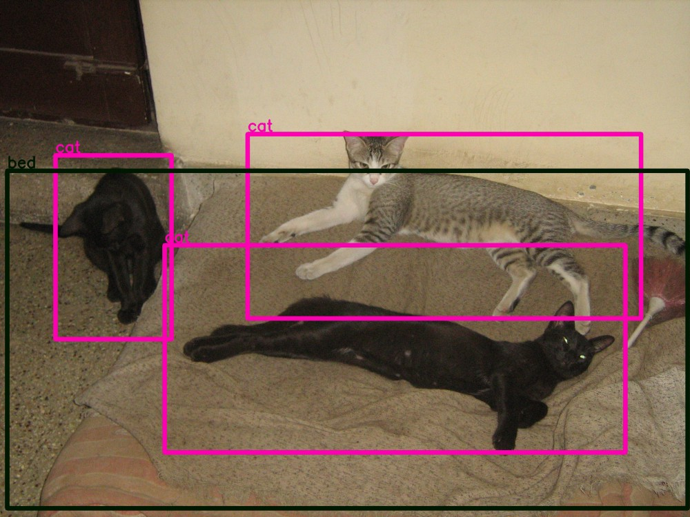
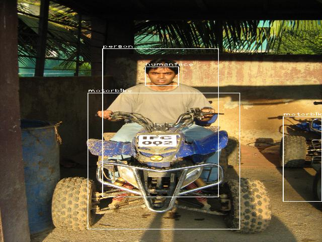
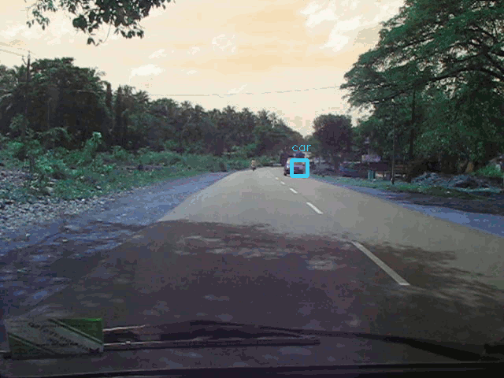
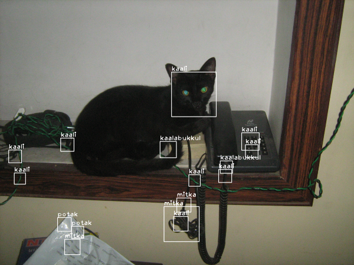

# Deep Visual Miner for photos and videos

Deep visual mining for your photos and videos using deep convolutional neural network based object detector 
and traditional face detection + recognition techniques.

Table of Contents
=================

   * [What does this do / what problem does this solve?](#what-does-this-do--what-problem-does-this-solve)
   * [Hardware selection](#hardware-selection)
   * [Install Docker](#install-docker)
   * [Download the Docker images](#download-the-docker-images)
   * [Build your own Docker images](#build-your-own-docker-images)
   * [Test Docker images](#test-docker-images)
   * [Train the face recognizer](#train-the-face-recognizer)
   * [Prepare Pipeline Configuration](#prepare-pipeline-configuration)
   * [Start the Visual Mining](#start-the-visual-mining)
   * [Example Reports](#example-reports)

## What does this do / what problem does this solve?

This software enables you to detect stuff - objects, people, animals, etc - and optionally attempt to identify people and pets in your photo and video collections.

It opens up the possibility of implementing a search engine for the content in your photo collections by integrating its output 
with a database like PostgreSQL or a text search engine like Solr.

## Demos

Some example annotated photos and videos produced using the reports generated by this tool:

*Object Detection* in your photos:




*Object Detection* in your videos:




*Face Recognition* in your photos and videos:



## Hardware selection

While this software has been tested as runnable on a modest laptop with 8GB RAM and an old core-i3 CPU, it's both a memory and CPU hog even if there's just a single deep object detector, since it creates one detector per core on the machine. Run it on a machine with high CPU cores and RAM. 

It expects the photo collection to be available on local filesystem, and saves outputs - such as results of detection and recognition in text format, annotated photos, annotated video frames and annotated videos - on local filesystem. Annotated video frames are especially heavy on storage. So storage capacity should accommodate not only the the photo collection itself but also configured output files from the processing pipeline.


## Install Docker

The software along with all its dependencies are packaged in a Docker image so that it can
be deployed on any distribution without hassle and run as containers.

For running it, first you have to install Docker.

Click the link to your OS or distribution in the [Docker installation page](https://docs.docker.com/engine/installation/) 
for instructions to install Docker-CE.

For Ubuntu 16.04, these steps taken from [https://docs.docker.com/engine/installation/linux/ubuntu/]:

 ```
 sudo apt-get install  apt-transport-https  ca-certificates  curl  software-properties-common

 curl -fsSL https://download.docker.com/linux/ubuntu/gpg | sudo apt-key add -

 sudo add-apt-repository \
   "deb [arch=amd64] https://download.docker.com/linux/ubuntu \
   $(lsb_release -cs) \
   stable"
   
 sudo apt-get update

 sudo apt-get install docker-ce
 ```


## Download the Docker images

For Haswell and later architecture machines, pull the image that contains optimized TensorFlow:

 ```
   docker pull pathbreak/deepvisualminer-haswell
   
 ```

For other x86-64 architecture machines, use the most compatible version that should work everywhere:

 ```
   docker pull pathbreak/deepvisualminer
   
 ```

In the rest of this document, I use `deepvisualminer`  as the image name in commands, but treat it as a placeholder and replace it with `deepvisualminer-haswell` or `your-custom-image-name`.

## Build your own Docker images

If you don't want to pull my Docker images published at https://hub.docker.com/r/pathbreak/deepvisualminer/
and https://hub.docker.com/r/pathbreak/deepvisualminer-haswell/,
you can build one or both on your own...

1. Install Docker on the machine where you'll be building the images. See [Install Docker](#install-docker) 
   for steps.

2. Clone this project repo from GitHub:

   ```shell
   git clone https://github.com/pathbreak/deepvisualminer
   cd deepvisualminer
   git checkout master 
   cd docker-deepvisualminer
   chmod +x *.sh
   ```

   The files required for building docker image are under `docker-deepvisualminer/` subdirectory.

   ​

3. Next, decide whether you want to build an optimized version of TensorFlow or use the stock
   version available in PyPI. If you want to use the stock version, skip the rest of this section 
   and jump to step 4 directly.

   ​

   The optimized version is optimized only for running on CPUs and is potentially faster at linear algebra
   operations because it uses modern CPU instruction sets like SSE4.x, SSSE3, AVX, AVX2, FMA, etc.
   If does **not** include GPU support (but you can enable it easily by adding '--config=cuda' and TF_NEED_CUDA=1
   in `build-tensorflow.sh` - note that neither these scripts nor images have not been tested for CUDA configuration).

   ​

   If you decide to build the optimized version, see 
   https://gcc.gnu.org/onlinedocs/gcc-5.4.0/gcc/x86-Options.html#x86-Options for a list of architectures and
   which instruction sets they contain, and edit the "CC_OPT_FLAGS='-march=[architecture]..." line appropriately in 
   `docker-deepvisualminer/build-tensorflow.sh`.

   ​

   Then run `launch-tensorflow.sh` to launch a container in which optimized TensorFlow gets built from
   source code. Beware: this takes a long time - 1 to 1.5 hours - and occupies a lot of RAM and CPU. That said,
   I've built it on a Core-i3 8GB machine with no problems or pauses...

    ```
    ./launch-tensorflow.sh 
    ```

    Once built, the optimized TensorFlow package is placed under `./shared/tensorflow/`.

   ​

4. Next, run `docker-deepvisualminer/build-image.sh` for building or downloading other prerequisites. 

     
   It builds Darkflow in a temporary container and downloads OpenCV detector data files:

   ```sh
   ./build-image.sh
   ```

   ​

   This command launches a temporary container to build the Darkflow object detection project.

   It's done in a separate container to avoid bloating up the primary deepvisualminer docker images 

   with build tools and artifacts.

   ​

   This script also downloads pretrained neural network weight files shared by Darkflow's author via Google Drive.

   Once the build is complete, the complete Darkflow release directory is copied under host system's `./shared/darkflow` directory.

   It downloads OpenCV cascade classifier pretrained models to `./opencv/data`.

   It downloads all the python scripts of this project in another subdirectory to copy them into the image.


5. Finally build the images.

   If you had selected to build optimized version of TensorFlow, build the optimized image 
   using the Dockerfile `docker-deepvisualminer/Dockerfile-custom-tensorflow`. For example:

   ```shell
   sudo docker build -t deepvisualminer-optimized -f Dockerfile-custom-tensorflow .
   ```

   If you had gone with the stock version of TensorFlow, build the stock image using the Dockerfile `docker-deepvisualminer/Dockerfile-stock-tensorflow`:

   ```shell
   sudo docker build -t deepvisualminer -f Dockerfile-stock-tensorflow .
   ```

   ​

   ​

6. Verify that the image is created:

   ```shell
   sudo docker images	
   ```

   ​


## Test Docker images

In order to test whether the Docker image you downloaded works on a target machine's CPU,
or to test whether one you built yourself is correct, start a test container and follow these steps:

 ```
 sudo docker run -ti --rm --name testdeepvisualminer deepvisualminer bash
 ```

 where `deepvisualminer` is the image name you downloaded (it'll be `deepvisualminer-haswell` if
 you downloaded the optimized version, or whatever name you gave if you built the image yourself).

 In the container shell, run this:
 ```
 cd ~/deepvisualminer
 python3 testimage.py
 ```
 If everything is ok, there shouldn't be any errors or warnings. If you see `Illegal instruction` errors,
 you've downloaded the wrong image or built one for a higher architecture by mistake.

 

## Train the face recognizer

The face recognizer has to be "trained" before it can recognize any faces.

Training basically means the recognizer runs an algorithm on a set of facial images to
work out a mathematical model of the faces. It uses this model later during recognition 
to find out which face it saw during training resembles the input face best.

Steps are:

+ Go through your photo collections and select a subset of photos containing all 
  the individuals whose faces you want the system to recognize. 

  Select minimum 15 photos for each individual. 
  The more photos you use for training, the more accurate recognition will be.

  The system can't use videos for training. If a photo you want is inside a video,
  use a screenshot tool (Shutter on Ubuntu is excellent) or frame extractor (ffmpeg can do it)
  to save that frame as an image.

+ Do not mix species! If you want the system to recognize people and cats, 
  create one subset containing people and a separate one containing cats, 
  and train them separately as two different models.

+ The poses should match the kind of recognition you want. If you want people to be recognized 
  from a frontal face photo, select frontal face photos for training too; if you want 
  side profile recognition, select side profile photos.

+ Use an image editor like Gimp or Photoshop to crop only the facial areas, 
  and export the cropped areas as PNG files. Try to exclude any area not part of the 
  face - such as neck, clothes, hair, background.

  There's no need to manually resize all cropped images to the same size - you risk losing 
  useful information that way. The script is capable of statistically analyzing all images in the 
  dataset and resizing them all to ideal dimensions.

  Save the cropped images in a directory structure like this:

  ```
    \peoplefrontfaces
       \person-1
          image1.png
          image2.png
          ...
          
       \person-2
          image1.png
          image2.png
          ...
          
    \catfrontfaces
       \cat-1
          image1.png
          image2.png
          ...
          
       \cat-2
          image1.png
          image2.png
          ...

  ```

  Here, 'person-1', 'cat-1', etc should be their actual names because they are  output in reports and annotated images.


+ Transfer these images to the target machine(s) where you plan to run the miner.

+ Run a statistical analysis on the set of facial image to find out an ideal resizing
  dimension. All training and testing images should be of the same size for the math
  to work correctly. Even during recognition, the detected facial region should be
  resized to this same image size for recognition to work at all.

  ```shell
  sudo docker run --rm \
    -v [TOP-DIR-OF-IMAGES]:/root/images \
    deepvisualminer \
    python3 /root/deepvisualminer/facerec_train.py stats /root/images
  ```

  It'll output the mean, median and histograms of widths and heights:

  ```t
  Mean width= 365.283018868
  Median width= 334.0
  Width histogram:  (array([20,  7,  9,  8,  2,  5,  1,  0,  0,  1]), array([  160. ,   248.4,   336.8,   425.2,   513.6,   602. ,   690.4,
           778.8,   867.2,   955.6,  1044. ]))
  Mean height= 369.226415094
  Median height= 311.0
  Height histogram:  (array([18, 12,  5,  7,  5,  5,  0,  0,  0,  1]), array([  153. ,   244.8,   336.6,   428.4,   520.2,   612. ,   703.8,
           795.6,   887.4,   979.2,  1071. ]))
  ```

  The histograms tell how many images fall in a certain range of widths. For example, in the output above 20 images are in the width range between 160 and 248.4 pixels. 

  The median width and height are usually a good selection. But also have a look at the histograms to make a decision. Size selected at training should be somewhat close to expected sizes during recognition. For example, if you train on HD size images but attempt to recognize small video frames like 320x240, it'll probably fail because the small frames introduce lot of noise when expanded to HD size.

+ Resize all images to desired width and height using the script. For example, to resize all images to their median width and height:

  ```shell
  mkdir -p ./resized-334x311

  # Resize to 334x311. The 1 at the end means convert to grayscale, which is necessary for face recognition
  sudo docker run --rm \
    -v [TOP-DIR-OF-IMAGES]:/root/images \
    -v $(pwd)/resized-334x311:/root/resized \
    deepvisualminer \
    python3 /root/deepvisualminer/facerec_train.py resize /root/images /root/resized 334 311 1 0
  ```

  The arguments are

  ```
  [IMAGE-DIRECTORY] [DIRECTORY-FOR-OUTPUT-RESIZED-IMAGES] [WIDTH] [HEIGHT] 
    [MAKE-GRAYSCALE] [EQUALIZE-HISTOGRAM]

  [MAKE-GRAYSCALE] should be 1 when resizing for purposes of face recognition. 
  But this command can also serve as a general purpose resizer to resize a set 
  of color images and in that case MAKE-GRAYSCALE should be 0.

  [EQUALIZE-HISTOGRAM] is an image filter that distributes intensities more evenly 
  if some intensities are more frequent. It's a good way to improve contrast of 
  low intensity or high intensity images. 
  Start with 0 for first round of training to measure base accuracy levels of the 
  models, and then set to 1 for a retraining phase to see if accuracy improves.
  ```

  ​

+ Before starting training, generate a CSV file listing of all the resized images and their labels:

  ```shell
  mkdir -p ./reports

  sudo docker run --rm \
    -v $(pwd)/resized-334x311:$(pwd)/resized-334x311 \
    -v $(pwd)/reports:/root/reports \
    deepvisualminer \
    python3 /root/deepvisualminer/facerec_train.py csv  \
        $(pwd)/resized-334x311  \
        /root/reports/dataset.csv
  ```

  In order to make the script output the host's filepaths in CSV, we map the image directory path on host to the exact same directory in container. The dataset CSV helps us split the dataset into training and testing subsets which is a standard practice in machine learning. 

+ Finally, we can now **train** the face recognizer. Its output is a set of _model_ files that is used later for recognition:

  ```shell
  mkdir -p ./catsmodel

  sudo docker run --rm \
    -v $(pwd)/resized-334x311:$(pwd)/resized-334x311 \
    -v $(pwd)/reports:/root/reports \
    -v $(pwd)/catsmodel:/root/catsmodel \
    deepvisualminer \
    python3 /root/deepvisualminer/facerec_train.py train /root/reports/dataset.csv \
      80 /root/reports/testset.csv /root/catsmodel 1 1 1
  ```

  The arguments for the command are:

  ```
  [PATH-OF-DATASET-CSV] => The container accessible path where CSV of dataset is 
    available, previously generated using a 'facerec_train.py csv' command

  [PERCENT-OF-SAMPLES-TO-USE-AS-TRAINING-IMAGES] => Proportion of images in 
    dataset to use for training. 60-80% is typical. Do not set below or 
    above that range.

  [OUTPUT-PATH-FOR-TESTING-SET-CSV] => Path where the list of files selected 
    as test set are written. This is necessary to avoid testing on the training samples.

  [MODEL-DIRECTORY] => The directory where recognizer will output model files.

  [USE-EIGENFACES] => 0 or 1. 1 means train an eigenfaces model on the training set.

  [USE-FISCHERFACES] => 0 or 1. 1 means train a fischerfaces model on the training set.

  [USE-LBPHFACES] => 0 or 1. 1 means train a local binary pattern histogram model on the training set.

  It's recommended to set all the USE- flags to 1 so that you can evaluate different algorithms at recognition time.
  ```

+ Test the accuracy of your trained model on the test set. It outputs the accuracy of each model on the test set:

  ```shell
  sudo docker run --rm \
    -v $(pwd)/resized-334x311:$(pwd)/resized-334x311 \
    -v $(pwd)/reports:/root/reports \
    -v $(pwd)/catsmodel:/root/catsmodel \
    deepvisualminer \
    python3 /root/deepvisualminer/facerec_train.py test \
      /root/reports/testset.csv /root/catsmodel 1 1 1
  ```

  The arguments for the command are:

  ```
  [PATH-OF-TESTING-SET-CSV] => The container accessible path where testing set CSV 
    of dataset is available, previously generated by 'facerec_train.py train' command

  [MODEL-DIRECTORY] => The directory where trained model files are available.

  [USE-EIGENFACES] => 0 or 1. 1 means use eigenfaces model for testing.

  [USE-FISCHERFACES] => 0 or 1. 1 means use fischerfaces model for testing.

  [USE-LBPHFACES] => 0 or 1. 1 means use local binary pattern histogram model for testing.

  It's recommended to set all the USE- flags to 1 so that you can evaluate accuracies of 
    all algorithms.
  ```

+ **Improving accuracy** 

  Some tips to improve accuracy:

  + By far, the best method is to collect more facial images - preferably taken in different lighting conditions and with different expressions - and retrain repeatedly until desired accuracy is reached. When you expand the size of the dataset or modify images in some way, you need to repeat all the steps above starting from collecting statistics and resizing.
  + Do a retraining with equalize histogram enabled, and test if accuracy improves.
  + Experiment by resizing to different dimensions.


## Prepare Pipeline Configuration

The software comes with a number of predefined pipeline configuration files - these are the .yml YAML format files in the root directory.

Take a look at the [example pipeline with all components](example-pipeline.yml) or any of the other .yml files to understand creating your own pipeline configurations.

Download one of those files, modify it and upload to your target machine(s). They can then be shared with the container by mounting the host's files or directories in the container.


## Start the Visual Mining

Start the visual mining on a machine with this command:

```shell
sudo docker run --rm \
  -v [IMAGE-FILE-OR-DIRECTORY-ON-HOST]:[IMAGE-FILE-OR-DIRECTORY-PATH-IN-CONTAINER] \
  -v [OUTPUT-DIRECTORY-ON-HOST]:[OUTPUT-DIRECTORY-PATH-IN-CONTAINER] \
  -v [PIPELINE-FILE-ON-HOST]:[PIPELINE-FILEPATH-IN-CONTAINER] \
  ...
  -v [ANY-OTHER-PATHS-IN-PIPELINE-FILE]:[FILEPATH-IN-CONTAINER] \
  ...
  deepvisualminer \
  python3 /root/deepvisualminer/visualminer.py \
  	[IMAGE-FILE-OR-DIRECTORY-PATH-IN-CONTAINER] \
  	[OUTPUT-DIRECTORY-PATH-IN-CONTAINER] \
  	[PIPELINE-FILEPATH-IN-CONTAINER]
```

In order to keep the image file paths in text reports match the actual file paths on host, it's advisable to make `[IMAGE-FILE-OR-DIRECTORY-PATH-IN-CONTAINER]` exactly the same as `[IMAGE-FILE-OR-DIRECTORY-ON-HOST]`


Not only should the input file/dir, output dir and pipeline file be mapped, but also any paths inside the pipeline file, especially the face recognition models directory. 


The following paths however in pipeline files are already part of the container's image and need not be mapped to the host:

+ /root/darkflow/*
+ /root/data*


Example for mining a single photo or video: 

```shell
sudo docker run --rm \
  -v $HOME/myvacationphotos/family.jpg:$HOME/myvacationphotos/family.jpg \
  -v $HOME/myvacationphotos-reports:/root/reports \
  -v $HOME/mypipeline.yml:/root/mypipeline.yml \
  -v $HOME/models/familyfacesmodel:/root/models/familyfacesmodel \
  deepvisualminer \
  python3 /root/deepvisualminer/visualminer.py \
    $HOME/myvacationphotos/family.jpg \
    /root/reports \
    /root/mypipeline.yml
```


Example for mining a directory of photos and videos. The output directory will have the same directory structure as input directory:

```shell
sudo docker run --rm \
  -v $HOME/myvacationphotos:$HOME/myvacationphotos \
  -v $HOME/myvacationphotos-reports:/root/reports \
  -v $HOME/mypipeline.yml:/root/mypipeline.yml \
  -v $HOME/models/familyfacesmodel:/root/models/familyfacesmodel \
  deepvisualminer \
  python3 /root/deepvisualminer/visualminer.py \
    $HOME/myvacationphotos \
    /root/reports \
    /root/mypipeline.yml
```

## Example Reports

Reports are in JSON format. 

[Example report of an image](example-image-report.json)

[Example report of a video](example-video-report.json)


